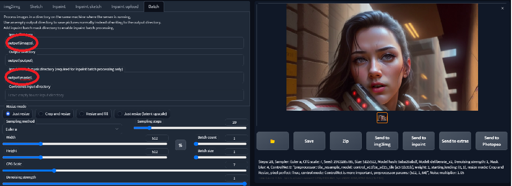

# Wav2Lip UHQ Improvement Script

This repository contains a script designed to enhance videos generated by the [Wav2Lip tool](https://github.com/Rudrabha/Wav2Lip).


Result video can be find here : https://www.youtube.com/watch?v=-3WLUxz6XKM

## Description

This script provides an enhancement to the videos generated by the Wav2Lip tool. It improves the quality of the lip-sync videos by applying specific post-processing techniques with controlNet 1.1.

## Prerequisites
- Stable diffusion webui automatic1111 + ControlNet 1.1 extension
- Python 3.6 or higher
- FFmpeg

1. You can install Stable Diffusion Webui by following the instructions on the [Stable Diffusion Webui](https://github.com/AUTOMATIC1111/stable-diffusion-webui) repository.
2. You can install ControlNet 1.1 extension by following the instructions on the [ControlNet 1.1](https://github.com/Mikubill/sd-webui-controlnet) repository.
3. Download ControlNet model **control_v11f1e_sd15_tile** at [ControlNet Models]https://huggingface.co/lllyasviel/ControlNet-v1-1/tree/main and install it in controlnet models folder in automatic1111
4. FFmpeg : download it from the [official FFmpeg site](https://ffmpeg.org/download.html). Follow the instructions appropriate for your operating system.

## Installation

1. Clone this repository.
```bash
git clone https://github.com/numz/wav2lip_uhq.git
```
2. go to the directory
```bash
cd wav2lip_uhq
```

3. Create venv and activate it.
```bash
python3 -m venv venv
source venv/bin/activate
```
3. Install the required Python libraries using the command :
```bash 
pip install -r requirements.txt
```

## Usage
1. Launch Stable diffusion webui with "--api" flag.
2. Choose your model in stable diffusion webui.
3. Run using the following command:

```bash
python wav2lip_uhq.py -f <file> -i <input_file>
```

Here is a description of each argument:

- `-f` or `--file`: Path to the video generated by Wav2Lip.
- `-i` or `--input_file`: Path to the original video.
- `-p` or `--post_process`: if set to false script only create images and mask for alternative process

## Operation

This script operates in several stages to improve the quality of Wav2Lip-generated videos:

1. **Mask Creation**: The script first creates a mask around the mouth in the video.

2. **Video Quality Enhancement**: It takes the low-quality Wav2Lip video and overlays the low-quality mouth onto the high-quality original video. 

3. **ControlNet Integration**: The script then sends the original image with the low-quality mouth and the mouth mask to ControlNet. Using the `automatic1111` API, it requests ControlNet to perform a render on the mouth, thereby enhancing the final quality of the video.

## Payload

in the file "payloads/controlNet.json" you'll find the payload send to automatic1111 api. feel free to change it to your needs.
following parameters could drastically change the result:
- denoising_strength (0.2 - 1.0) default 1, high value can create flickering, low value can create blurry result
- mask_blur (0 - 50) default 8
- alwayson_scripts > controlnet > args > threshold_a (1 - 32) default 1
- alwayson_scripts > controlnet > args > threshold_b (1 - 32) default 32

## alternative usage
if you set `-p` or `--post_process` to "False", the script will only create images and masks. you can then use those folders in automatic1111 webui in img2img Batch mode:

It will give you more control over the result

## Contributing

Contributions to this project are welcome. Please ensure any pull requests are accompanied by a detailed description of the changes made.

## License

Specify the open-source license under which your project is published here.

## Contact

Provide your contact details here for any questions or comments about the project.